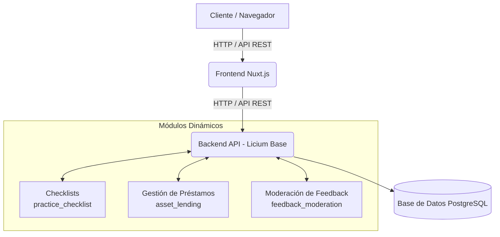

# 📦 Proyecto Licium: Módulos Personalizados

Este proyecto contiene un conjunto de módulos desarrollados para el framework **Licium**. Actualmente, el repositorio aloja múltiples módulos diseñados para extender de manera natural las amplias capacidades del sistema base: **Checklists Prácticos (`practice_checklist`)**, **Gestión de Préstamos de Activos (`asset_lending`)**, y un tercer módulo en actual etapa de concepción destinado a la **Moderación de Feedback (`feedback_moderation`)**.

---

## 🏗 Arquitectura General del Proyecto

El proyecto está diseñado bajo una robusta arquitectura modular. El **Backend**, apoyado en FastAPI, expone una API REST moderna y se apoya en una base de datos **PostgreSQL** para la persistencia. Por otro lado, un **Frontend** reactivo y desacoplado, construido sobre Nuxt.js, consume estos puntos de entrada. Todos los módulos que se detallan a continuación extienden el núcleo (core) de la aplicación inyectándose de manera totalmente dinámica en tiempo de ejecución.



---

## 📂 Estructura General del Repositorio

La estructura de carpetas a nivel raíz contiene la configuración local indispensable de los servicios, siendo la carpeta clave `modules/` donde radican los proyectos propios.

```text
modulo-checkList/
├── docker-compose.backend-dev.yml  # Configuración integral de los servicios en Docker
├── filestore/                      # Almacenamiento local persistente de archivos generados y logs
└── modules/                        # ➔ Directorio raíz de los submódulos de la aplicación
    ├── practice_checklist/         # Proyecto 1: Módulo de Checklists (Principal)
    ├── asset_lending/              # Proyecto 2: Módulo de Gestión de Activos y Préstamos
    └── feedback_moderation/        # Proyecto 3: Módulo de Moderación de Feedback
```

---

## 🧩 Detalle de los Proyectos / Módulos

### 📌 Nivel 1: Checklists de Práctica (`practice_checklist`)

Este módulo fue diseñado para gobernar un sistema completo y persistente en el que permite crear, administrar y visualizar **Checklists** completamente estructurados. Cada checklist actúa como un contenedor de múltiples **Tareas (Items)** granulares, lo cual es ideal para realizar auditorías, controles rutinarios (QA) o procesos de validación secuenciales. Además incorpora opciones para mejorar y automatizar el flujo de trabajo, como el cierre automático tras no tener actividad por determinados días.

#### 📂 Estructura Interna y Entidades

```text
practice_checklist/
├── __manifest__.yaml       # Define las dependencias del módulo (depende fuertemente de 'ui'), versión y los ficheros de carga en orden
├── data/                   # Archivos de aprovisionamiento de configuración base
│   ├── acl_rules.yml       # Reglas de las Listas de Control de Acceso (ACLs) y directrices de seguridad
│   ├── groups.yml          # Estructura e inserción por defecto de los Grupos de usuarios
│   └── ui_modules.yml      # Manifiesto que instruye al frontend cómo incluir este ecosistema en la interfaz
├── i18n/                   # Traducciones e internacionalización (es.yml, en.yml) para multilingüismo
├── models/
│   └── checklist.py        # 🗄️ Definición ORM (SQLAlchemy) de los Modelos de Datos.
│                           # Relacionan bases y configuración avanzada bajo una estructura relacional pura.
├── services/
│   └── checklist.py        # ⚙️ Controladores con lógica de negocio o validación transaccional previo al ingreso en BD
└── views/                  # UI del backend para inyectarse al core
    ├── menu.yml            # Árbol de navegación y accesos menú a inyectarse en el Front-End
    └── views.yml           # Declaración y estructura de la organización, de listas y formularios visibles
```

#### 🗄️ Modelos Principales
*   **`PracticeChecklist`**: Entidad maestra del checklist. Almacena campos críticos como `name` (Nombre del checklist), `status` (Borrador, Abierto, Cerrado), `is_public` (visibilidad global) y `owner_id` (Relación M:1 hacia el usuario propietario del checklist).
*   **`PracticeChecklistItem`**: Múltiples actividades dentro del Checklist maestro. Mantiene una clave foránea `checklist_id` y además permite asignar a usuarios específicos (`assigned_user_id`) mediante campos vitales como `title`, notas opcionales (`note`), y estados transaccionales (`is_done`, `done_at`).
*   **`PracticeChecklistSetting`**: Modelo persistente de configuración para dictar reglas automáticas, como booleanos `auto_close` ligados con número de días configurables (`days_to_close`).

---

### 📌 Nivel 2: Gestión de Préstamos (`asset_lending`)

Supervisión, administración de inventarios robustos, y ciclo de vida de préstamos son el pilar de este módulo. Permite censar los distintos activos (`Assets`), establecer y gestionar los espacios físicos definidos como almacenes (`Locations`) para dichos activos y, sobre todo, gobernar centralmente las asignaciones, devoluciones y mora (`Loans`) asociados a cada respectivo usuario.

#### 📂 Estructura Interna y Entidades

```text
asset_lending/
├── __manifest__.yaml       # Identificador base del recurso. Indica versión, nombre técnico y orden preciso de inyecciones (grupos, acls, UI, vistas y menús).
├── models/
│   ├── asset.py            # (Archivos unificados internamente en lending.py)
│   ├── lending.py          # 🗄️ Entidades unificadas relacionadas con toda la gestión: Location, Asset y Loan
│   └── location.py         
├── security/               # Reglas y políticas de seguridad (Access Controls Lists directas)
│   └── access_control.yml
├── services/               # ⚙️ Scripts de lógica interna, handlers y validadores correspondientes a los servicios
│   └── asset_service.py    #         de Locations, Assets, AssetLoans.
└── views/
    ├── menu.yml            # Rutas de entrada a la interfaz (Menús laterales)
    └── views.yml           # Listados, Action windows, y definiciones de plantillas y layouts.
```

#### 🗄️ Modelos Principales
*   **`Location`**: Modela lugares de almacenamiento o depósito físico en el sistema. Almacena su nombre, código único (`code`) y si se encuentra activo o en desuso.
*   **`Asset`**: Base de recursos físicos a ser prestados, definidos por `name`, y clasificados inequívocamente con `asset_code`. Disponen de un control de estado en tiempo real (Disponible, En Préstamo, Mantenimiento) y lógicamente vinculados a ubicaciones `location_id`.
*   **`Loan`**: Archiva todo rastro documental del préstamo realizado entre un usuario y un activo `asset_id`. Comprende variables obligatorias de seguimiento de tiempo como cuándo fue prestado (`checkout_at`), estimación máxima exigible de devolución (`due_at`) y cierre final (`returned_at`), junto con variables semánticas de estado (`status` abierto, devuelto, o atrasado). Permite notas anexas en salida y retorno.

---

### 📌 Nivel 3: Moderación de Feedback (`feedback_moderation`)

Este módulo implementa un sistema estructurado de captura, clasificación y moderación de sugerencias y retroalimentación. Está diseñado para que los usuarios puedan aportar ideas (`Suggestions`) y comentarlas (`Comments`), mientras un equipo con rol de moderador aprueba, rechaza o fusiona estas aportaciones antes de hacerlas visibles de forma pública.

#### 📂 Estructura Interna y Entidades

```text
feedback_moderation/
├── __manifest__.yaml       # Define dependencias (requiere 'ui'), versión y orden de carga
├── data/                   # Archivos de aprovisionamiento de configuración base (ACLs, grupos, etc.)
├── models/
│   └── feedback.py         # 🗄️ Definición ORM (SQLAlchemy) de los Modelos (Tag, Suggestion, Comment)
├── services/
│   └── feedback.py         # ⚙️ Servicios y manejadores transaccionales de moderación (publicar, rechazar, fusionar)
└── views/                  # Elementos UI del backend inyectados en el core
    ├── menu.yml            # Vías de navegación en el Front-End
    └── views.yml           # Representación de los formularios y listas
```

#### 🗄️ Modelos Principales
*   **`Suggestion`**: Entidad central que canaliza una idea o reporte. Almacena campos como `title`, `content` y `author_email`, controlando estrictamente su visibilidad mediante un manejador de estados `status` (Pendiente, Publicada, Rechazada, Fusionada) y el boolean `is_public`. Admite notas de revisión `moderation_note` de parte del moderador.
*   **`Comment`**: Aportaciones adicionales y respuestas a una sugerencia específica (`suggestion_id`). Siguen un flujo de moderación idéntico al requerir validación explícita (`status`) previa a su publicación.
*   **`Tag`**: Sistema de categorización ágil (`name`, `slug`, `color`) vinculado de forma Muchos-a-Muchos a las sugerencias, permitiendo agruparlas semánticamente.

---

## 🚀 Guía Rápida de Despliegue en Entornos de Desarrollo Local (Docker Compose)

El proyecto incluye de manera estandarizada un entorno pre-configurado garantizado y versionado por la infraestructura mediante el empleo de **Docker Compose** en el archivo `docker-compose.backend-dev.yml`. Este utilitario orquesta y levanta la red y todos los contenedores indispensables para correr y aportar modificaciones al sistema directamente con herramientas locales.

### 🛑 Requisitos Previos Necesarios
*Tener instalado **Docker** y el plugin **Docker Compose (v2+)**.*

### ▶️ Puesta en Marcha

1. **Inicie los servicios** corriendo el siguiente comando desde el directorio central de `modulo-checkList`:
   ```bash
   docker-compose -f docker-compose.backend-dev.yml up -d
   ```
2. **Servicios y Entornos expuestos globalmente**:
   * `postgres` (Base de datos relacional): Sirviendo nativamente mediante el puerto local de desarrollo `5432`.
   * `backend` (FastAPI / Motor de Licium Base): Resolviendo en el puerto `8000`. Expone el servidor web API y el backend administrativo, inyectando y montando en tiempo vivo los módulos en la ruta `/opt/licium/modules`.
   * `frontend` (Nuxt.js UI): Activo en el puerto `3000`. Es la interfaz moderna final interactiva conectada por peticiones asincrónicas a la API del backend.
